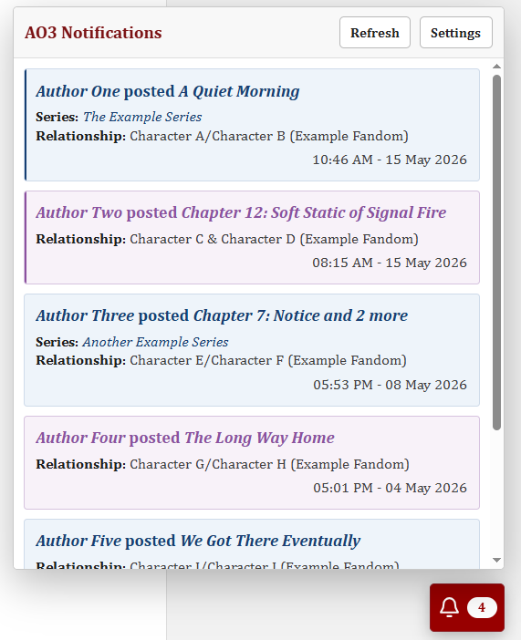

# AO3 Notifications

AO3 Notifications is a personal Tampermonkey userscript plus Google Apps Script service that shows Archive of Our Own email notifications directly on AO3 pages.

The project is unofficial and is not affiliated with Archive of Our Own, the Organization for Transformative Works, Google, Gmail, or Tampermonkey.

## Screenshots

Screenshots use fictional demo data for display purposes only. They do not contain real AO3 usernames, work titles, relationships, timestamps, Gmail data, or notification content.

  

## Features

- Floating AO3 notification button on `archiveofourown.org`.
- Personal Google Apps Script service reads AO3 notification emails from the user's Gmail account.
- Notification cards for new works, single chapter updates, and bulk chapter updates.
- Unread count on the bell button and browser tab title.
- Auto-read when a card is mostly viewed.
- Cross-tab read-state sync through Tampermonkey storage.
- Manual Refresh button bypasses the Google Apps Script cache.
- Light/dark UI follows the current AO3 skin color.

## Files

- `tampermonkey.js` - browser userscript.
- `gscript.gs` - Google Apps Script service.
- `LICENSE` - AGPL-3.0-only license text.
- `NOTICE.md` - copyright, attribution, and unofficial-project notice.
- `PRIVACY.md` - privacy notes and disclaimer.
- `AI_AUDIT_GUIDE.md` - guide for reviewing the code with AI before installation.

## How It Works

`gscript.gs` searches the user's Gmail account for AO3 notification emails, parses them into notification objects, and returns JSON.

`tampermonkey.js` runs on AO3 pages, calls the user's Google Apps Script deployment, groups chapter updates by work, and renders notification cards in a Shadow DOM widget.

Normal auto-refresh requests use the Google Apps Script cache. Clicking `Refresh` sends `bypassCache=1`, forcing the service to read Gmail again.

## Video Tutorial

[Watch the step-by-step installation guide on YouTube](https://www.youtube.com/watch?v=pZSqFrDbJJA)

## Installation

### 1. Deploy the Google Apps Script service

1. Create a new Google Apps Script project.
2. Replace the default code with the contents of `gscript.gs`.
3. Save the project (Ctrl + S).
4. Deploy it as a web app.
5. Use the most restrictive access setting that still lets your own browser call the deployment. Do not expose the deployment publicly unless you understand the risk.
6. Authorize the script when Google asks for Gmail access.
7. Copy the deployment ID.

### 2. Install the Tampermonkey userscript

1. Install Tampermonkey in your browser.
2. Create a new userscript.
3. Use the contents of `tampermonkey.js`.
4. Save the userscript (Ctrl + S).
5. Open AO3.
6. Click the AO3 Notifications bell.
7. Paste the Google Apps Script deployment ID.
8. Set `Number of Notifications` to the number of cards you want displayed.
9. Save.

## Configuration

The main configuration values are inside each source file.

In `tampermonkey.js`:

- `defaultNotificationLimit`: Default number of cards shown.
- `maxNotificationLimit`: Maximum number of cards the user can show.
- `autoRefreshIntervalMs`: Automatic refresh interval.
- `fontFamily`: Widget font. The default script uses Cambria, but users are encouraged to change it to their preference. Arial is the safest general-purpose choice.

In `gscript.gs`:

- `ao3NotificationQuery`: Gmail search query for AO3 notification emails.
- `gmailThreadLimit`: Number of Gmail threads searched.
- `notificationLimit`: Maximum parsed notifications returned by the service.
- `cacheTtlSeconds`: Google Apps Script cache lifetime.

## Privacy

This project is designed to run under the user's own browser and Google account.

The author does not receive AO3 email content, Gmail data, deployment IDs, or notification data. See `PRIVACY.md` for details.

Before installing, users are encouraged to review the source code. `AI_AUDIT_GUIDE.md` includes a prompt for independent AI-assisted review.

## Acknowledgements

This project was inspired by PhaiRice, the Phainon x Castorice pairing from Honkai: Star Rail (miHoYo). They are the reason behind the name `phairiceismyotp` and the blue-purple alternating theme in the Tampermonkey interface.

My deepest thanks go to the friends and beta testers from the PhaiRice shipper community. Your support, testing, and suggestions helped shape this project from a small personal tool into something worth sharing.

Thank you, sincerely.

## License

AO3 Notifications is licensed under AGPL-3.0-only. See `LICENSE` for the full license text.

Copyright (c) 2026 phairiceismyotp (or3zz - Nguyen Tin)
